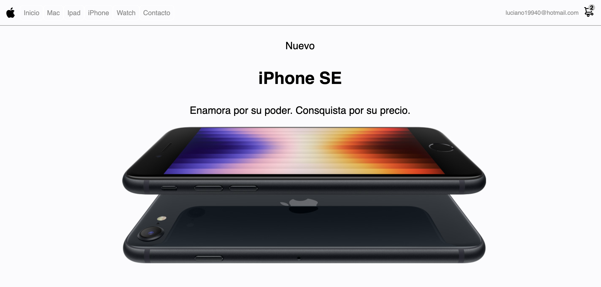
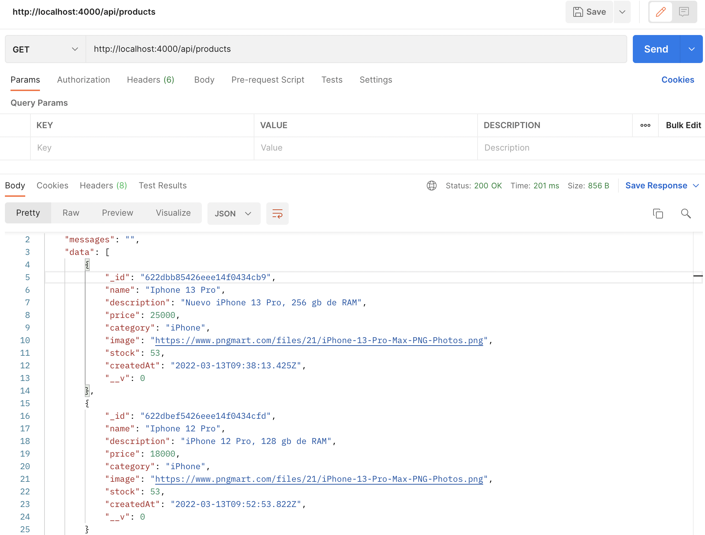

# Proyecto Ecommerce "Apple Store" - API



Este proyecto está hecho con React JS. Se conecta esta tienda virtual Frontend con Backend. Desarrollado por Kevin Luciano, las imágenes, nombres de productos y precios son de caracter ilustrativo, propiedades de © Apple Inc.

# Dependencias instaladas
* Express v4.17.3
* Express validator v6.14.0
* Body Parser v1.19.2
* MongoDB v4.4.1
* Mongoose v6.2.6
* Nodemon v2.0.15
* Cors v2.8.5
* Dotenv v16.0.0
* Jsonwebtoken v8.5.1

# Correr el proyecto localmente
## Repositorio Frontend y Backend
### Frontend
```
git clone https://github.com/kalg12/Ecommerce-Apple-Store.git
```
### Backend
```
git clone https://github.com/kalg12/API-Ecommerce-Apple-Store.git
```

## Instale las dependencias de cada proyecto
Desde consola, en el directorio del proyecto, ejecute por cada repositorio clonado sus dependencias con:
```
npm install
```

## Ejecución del proyecto Frontend

En el directorio del proyecto, puede ejecutar:

```
npm start
```

Al ejecutar **`npm start`** abrirá en su navegador la siguiente dirección: [http://localhost:3000](http://localhost:3000)

La página se volverá a cargar cuando realice cambios de manera automática.
También puede ver errores del proyecto en caso de implementar código o correcciones directo en la consola.

## Ejecución del proyecto Backend

En el directorio del proyecto, puede ejecutar:

```
npm start
```

Al ejecutar **`npm start`** se mostrará en consola un mensaje de conexión correcta a la base de datos, de lo contrario, mostrará un mensaje de error con detalles para su solución.

Además se ejecutará una dirección [http://localhost:4000](http://localhost:4000)

Cabe señalar que este se ejecuta en el puerto `4000`

## Consulta del API

Una vez ejecutado el proyecto backend, puede utilizar una aplicación que le permite realizar pruebas API.

### Productos

#### GET
Para realizar la consulta de productos de la tienda, puede hacerlo con el siguiente enlance:
```
http://localhost:4000/api/products
```
Verá algo similar como la siguiente imagen


#### POST
Para realizar la creación de productos de la tienda, puede hacerlo con el siguiente enlance:
```
http://localhost:4000/api/products
```

Para insertar datos en el API, puede insertarlo mediante un objeto JSON de la siguiente manera:

```
{
    "name":"Iphone 11 Pro",
    "description": "iPhone 11 Pro, 64 gb de RAM",
    "price": 14999,
    "category": "iPhone",
    "image": "https://res.cloudinary.com/walmart-labs/image/upload/w_960,dpr_auto,f_auto,q_auto:best/mg/gm/1p/images/product-images/img_large/00085369892296l.jpg",
    "stock": 21
}
```

# Data base schema - MongoDB
## Productos
- [ ] Nombre - String
- [ ] Descripcion - String
- [ ] Precio - Number
- [ ] Categoria - String
- [ ] Imagen - String
- [ ] Stock - Number
- [ ] CreatedAt - Date